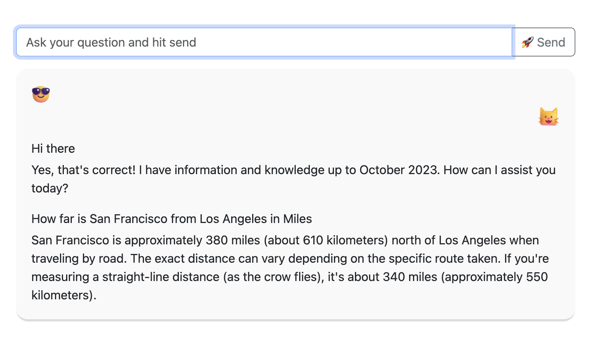

# Minimal Chat UI

Minimal chatui with chat history powered by file io, uses ChatGPT under the hood

# Preview

Start the flask dev server
[terminal.mov](terminal.mov)

Chat with ChatGPT on the UI
[chatui.mov](chatui.mov)

# Installation

- pip install -r requirements.txt

